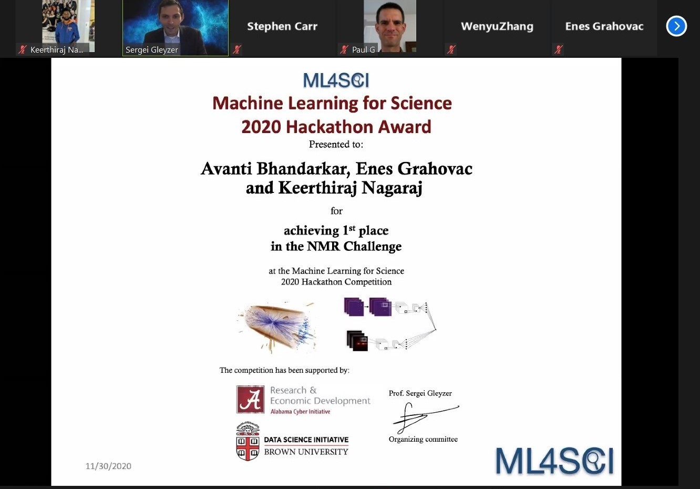

# ML4SCI-hackathon-project
 ML4SCI hackathon NMR spin challenge winning project 

I participated in **Machine Learning for Science (ML4SCI) Hackathon Competition** that took place virtually from **October 26-30, 2020** with Avanti Bhandarakar and Enes Grahovac, who are fellow students from University of Florida. The competition was sponsored by the University of Alabama Cyber Initiative and the Brown Data Science Initiative. The hackathon focused on applying **machine learning** techniques to scientific challenges, including those from the fields of physics, astronomy, planetary science and geoscience.

There were six main challenges:

* Higgs Boson Challenge (Classification, General)
* Particle Images Challenge (Classification, Computer Vision)
* Strong Lensing Challenge (Anomaly Detection)
* **NMR Spin Challenge (Multi-Target Regression)**
* Cosmic Rays in Planetary Science Images (Image Segmentation)
* Google Earth Engine Challenge (Anomaly Detection)

We competed in **NMR Spin Challenge**. 

### Problem Statement

- Nuclear Magnetic Resonance (NMR) is an experimental technique that allows for the control and measurement of nuclear spins in crystals and molecules.
- A common "recipe" for NMR is called the spin echo: the spins start aligned, begin to disperse, and are then refocused. This creates a sharp peak, or "echo", in the net magnetization M of the material at a later time. When the spins interact with each other, this refocused echo can become highly distorted.
- Materials with strong electron-electron couplings have a variety of applications, from superconductivity to ferromagnetism. They also tend to enhance the nuclear spin-spin couplings, allowing NMR to act as a probe of these important systems.
- Our goal was to design and train a machine learning models that predicts the strength and shape of interactions between the nuclear spins from simulated time-dependent magnetization curves, M(t).

More details about the problem, data and metrics used to award results are available from the below link.

https://github.com/ML4SCIHackathon/ML4SCI/tree/main/NMRSpinChallenge

We won the first place in NMR spin challenge in this hackathon and were awarded a certificate and some cool goodies. 

